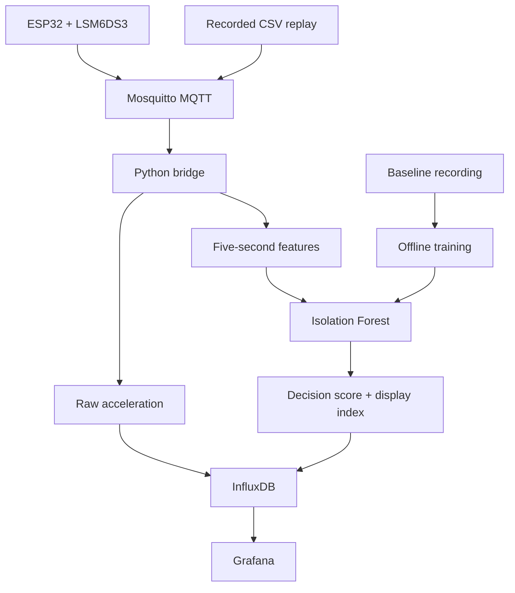

# Smart Machine Health Monitoring

A university group project that uses vibration readings to explore machine-condition monitoring. An ESP32 and LSM6DS3 sensor send acceleration readings through MQTT. Python stores the readings in InfluxDB, extracts features, and applies an Isolation Forest model. Grafana displays the readings and model output.

**Maintained by Venkatareddi Kumar Elisetty (VENKEY46).** Developed as a university group project. This repository includes the team recordings and practical improvements for setup, testing and documentation. See [project history and team credit](docs/attribution.md).

This is an educational prototype using a small fan. It demonstrates a monitoring workflow; it does not predict remaining machine life or provide a certified fault diagnosis.

## What the project includes

- ESP32 firmware for three acceleration axes.
- The team's baseline and imbalance recordings.
- Shared five-second feature extraction for training and live scoring.
- Local model training and a repeatable evaluation command.
- An MQTT-to-InfluxDB bridge and a provisioned Grafana dashboard.
- A recorded-data replay command for people without the hardware.
- Tests for signal features, bad readings, model paths and message processing.

## Architecture



Use either the sensor or replay as the source. Do not run both on the same topic at the same time.

The [original team architecture image](<End-to-end-System Architecture.jpg>) is also retained. The diagram above shows the added replay option and the runnable layout in this copy.

## Start here: run the recorded-data analysis

You need **Git and Python 3.12**. Docker and the ESP32 are not needed for this first part.

### 1. Download the repository

In a VS Code terminal or Windows PowerShell, run:

```powershell
git clone https://github.com/VENKEY46/Smart-Machine-Health-Monitoring.git
cd Smart-Machine-Health-Monitoring
```

You can also use **Code → Download ZIP**, extract it, and open the extracted folder in VS Code. Run the following commands in the folder containing this README. A ZIP does not include Git history.

### 2. Install the Python packages

These Windows commands use the virtual environment directly, so activation is not needed:

```powershell
python -m venv .venv
.\.venv\Scripts\python.exe -m pip install -r requirements.txt
```

On Linux/macOS, replace `.\.venv\Scripts\python.exe` below with `.venv/bin/python`.

### 3. Train your local model

```powershell
.\.venv\Scripts\python.exe -m backend.train_model
```

This reads `baseline_normal.csv` and creates three files in `models/generated/`:

| Output | Purpose |
|---|---|
| `isolation_forest_model.pkl` | Locally trained model |
| `score_range.npy` | Baseline score range for the display index |
| `training_report.json` | Window count, settings and package versions |

The supplied model binaries directly under `models/` are preserved as original artifacts. These commands use the model you train locally. Do not load untrusted pickle/joblib files.

### 4. Evaluate the fault recording

```powershell
.\.venv\Scripts\python.exe -m backend.validate_model
```

This evaluates `fault_imbalance.csv`. The reproduced result was **108 of 108 fault-recording windows flagged**, after training on **103 baseline windows**. This is one recording, not a general accuracy estimate. See [reproduced results and limits](docs/validation.md).

### 5. Run the tests

```powershell
.\.venv\Scripts\python.exe -m unittest discover -s tests -v
```

The review run passed **14 tests**. The GitHub Actions workflow runs these checks, training and evaluation on future pushes.

## Run the dashboard with recorded data

Finish steps 1–5 above first. This part also requires Docker Desktop to be running.

### 6. Create local settings

```powershell
Copy-Item .env.example .env
```

Open `.env` in VS Code. Replace `INFLUX_PASSWORD`, `GRAFANA_PASSWORD` and `INFLUX_TOKEN` with your own long values. For the token, you can generate a value locally:

```powershell
.\.venv\Scripts\python.exe -c "import secrets; print(secrets.token_hex(32))"
```

Paste that generated value after `INFLUX_TOKEN=`, then save with **Ctrl+S**. Keep `INFLUX_BUCKET=vibration` for the default dashboard. Your `.env` is ignored by Git.

### 7. Start the three services

```powershell
docker compose up -d
docker compose ps
```

| Service | Default address | Purpose |
|---|---|---|
| Mosquitto | `localhost:1884` | MQTT messages |
| InfluxDB | `http://localhost:8087` | Time-series database |
| Grafana | `http://localhost:3011` | Dashboard |

The separate ports let this project coexist with the DAC demo. If a port is already used, change the relevant port in `.env`. If you change `INFLUX_PORT`, also update `INFLUX_URL`. Re-run `docker compose up -d` to apply port changes.

InfluxDB creates the account, organisation, bucket and token when its volume is first initialized. Editing these settings later does not change an existing database account. Keep the original working values for an existing volume.

### 8. Start the bridge in Terminal 1

From the repository root:

```powershell
.\.venv\Scripts\python.exe -m backend.bridge
```

Wait for **Subscribed to sensors/fan1/vibration**. Leave this terminal running.

### 9. Start replay in Terminal 2

Open a second terminal in the same repository folder:

```powershell
.\.venv\Scripts\python.exe -m backend.replay_recording
```

This publishes the baseline recording using its recorded time gaps. After it finishes, you can replay the fault recording:

```powershell
.\.venv\Scripts\python.exe -m backend.replay_recording --file fault_imbalance.csv
```

This mode replays recorded data. It is not a live connection to the original fan. Network timing and shifted window boundaries can make live scores differ from the offline evaluation.

### 10. Open Grafana

Open **http://localhost:3011**. Sign in with `admin` and your `GRAFANA_PASSWORD`.

Go to **Dashboards → Machine Health → Smart Machine Health Monitoring**. The data source and dashboard are provisioned automatically. The panels show:

- Acceleration on the three axes, in g.
- A baseline-relative index from 0 to 100.
- The model decision score: a negative value means the model flags an anomaly.
- The received sample rate.
- The anomaly flag: 0 or 1.

Keep the range on **Last 15 minutes** and refresh on **5s**. Wait at least one scoring window after replay starts. A 0–100 index is a display scale, not a percentage probability of failure.

### 11. Stop the demo

Press **Ctrl+C** in both Python terminals, then run:

```powershell
docker compose stop
```

This keeps your database and Grafana volumes for the next session.

## Use the real university hardware

Follow [the hardware guide](docs/hardware.md) for wiring, private Wi-Fi settings, the exact sketch path, MQTT access and upload order. Start with recorded-data analysis before changing the hardware setup.

## Files and folders

| Path | What it contains |
|---|---|
| `baseline_normal.csv` | Original team baseline recording |
| `fault_imbalance.csv` | Original team fault recording |
| `Vibration_Sensor_Output.xlsx` | Original supplementary workbook |
| `feature_extraction.py` | RMS, kurtosis, crest factor, standard deviation and FFT peak |
| `backend/settings.py` | Root-relative paths and environment settings |
| `backend/train_model.py` | Baseline model training |
| `backend/validate_model.py` | Evaluation on the fault recording |
| `backend/bridge.py` | MQTT validation, database writes and live model scoring |
| `backend/replay_recording.py` | Recorded CSV replay over MQTT |
| `backend/InfluxDB_Generate_CSV_Script.py` | Export raw InfluxDB readings to CSV |
| `firmware/` | ESP32 sketch and a private-settings template |
| `models/` | Original artifacts and locally generated models |
| `docker-compose.yml` | Mosquitto, InfluxDB and Grafana services |
| `mosquitto/config/` | Local demonstration broker configuration |
| `grafana/` | Data-source and dashboard provisioning |
| `tests/` | Python checks |
| `docs/` | Hardware, results, limitations and team attribution |
| `.github/workflows/tests.yml` | Automated Python checks |

## Export a new recording

While the bridge has been receiving samples:

```powershell
.\.venv\Scripts\python.exe -m backend.InfluxDB_Generate_CSV_Script --start=-10m --output output/new_recording.csv
```

The file has `timestamp, ax, ay, az` columns. Keep the original recordings unchanged. Only train on a new baseline after checking that the source represents the normal condition you want to learn.

## Scope and limitations

- The project uses one small fan and one included fault recording. Other machines and fault types have not been validated.
- The magnitude includes gravity. This is not a calibrated vibration-velocity standard or a remaining-life model.
- MQTT arrival timestamps and Wi-Fi timing affect the estimated sample rate and FFT frequency. The sensor's `ts` value is uptime, not a synchronized UTC clock.
- Live and offline feature functions are shared, but their window alignment and timing differ.
- The bridge batches database writes. A queued log line is not proof of durable storage, and there is no durable retry queue.
- This is a single-sensor prototype. Multiple devices need distinct identities, topics and database tags.
- The broker is anonymous for local demonstration. Keep its default loopback binding for replay. Hardware access requires a deliberate trusted-network setup.
- Python analysis and tests were executed during this review. Docker startup, Grafana rendering and the ESP32 firmware changes still require a run on the local machine and physical hardware.

## Team credit and license status

See [attribution](docs/attribution.md). The upstream README stated “MIT License,” but its reviewed commit contained no `LICENSE` file. This copy does not add a license or change contributor ownership.
